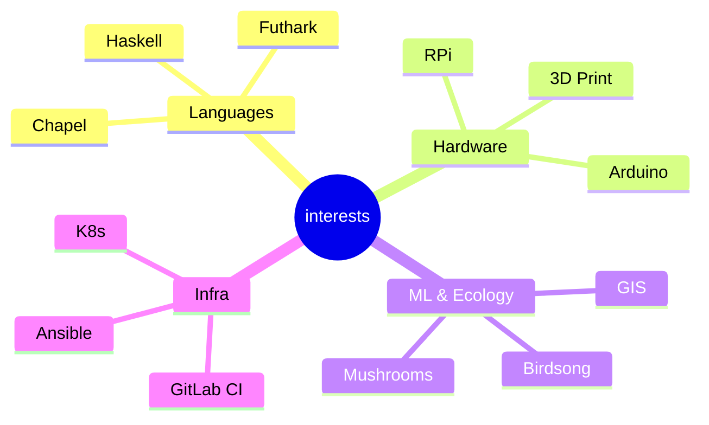

[![Typing SVG](https://readme-typing-svg.demolab.com?font=Fira+Code&pause=1000&color=36BCF7&center=true&vCenter=true&width=800&lines=Full+Stack+Engineer+%7C+DevSecOps+%7C+Agent+Orchestration+%7C+ML%2FHPC;Chapel+%7C+Haskell+%7C+Python+%7C+TypeScript+%7C+SvelteKit+%7C+Go;C%2B%2B+%7C+R+%7C+Zig+%7C+Nix+%7C+Rust+SIMD+%7C+Futhark+%7C+Emacs+Lisp;Computer+Vision+%7C+Fine-Grained+Classification+%7C+WASM+Inference;K8s+%7C+Ansible+%7C+GitLab+CI+%7C+Apache+Solr+%7C+Bazel;Global+DNS+%7C+k8gb+%7C+CoreDNS+%7C+NAT+Punching+%7C+MetalLB;GIS+%7C+Cartography+%7C+Remote+Sensing+%7C+R+%7C+QGIS;LangChain+%7C+LangGraph+%7C+pgvector+%7C+vLLM+%7C+Custom+Embeddings;Multilocal+Orchestration+%7C+RKE2+%7C+Rancher+%7C+OpenTofu;3D+Printing+%7C+OpenSCAD+%7C+Fusion+360+%7C+Arduino+%7C+RPi;TensorFlow+%7C+NumPy+%7C+Pandas+%7C+Flask+%7C+Docker+%7C+WebAssembly;9-String+Guitar+%7C+12-String+Acoustic+%7C+Rotary+Yamaha+Organ;ACME+Certs+%7C+SAML+%7C+KeePassXC+%7C+SearXNG+%7C+Caddy;Photography+%7C+Mass+Audubon+%7C+Goth+Nights+%7C+Bagel+Baker;Merlin+Sound+ID+%7C+Birder+%7C+Musician+%7C+Baker+%7C+Bard)](https://git.io/typing-svg)

<table style="border:0">
<tr><td valign="top" width="60%">

### Jess Sullivan

Full stack engineer, musician, and birdwatcher based in Lewiston, ME.

I spent about a year completely offline — no LinkedIn, no blog, no social media.
Late 2023 through the end of 2024. An intentional disconnect.

I'm back now, rebuilding in the open. I build infrastructure tooling, contribute to compilers
and languages, hack on hardware, and maintain a lot of FOSS. Previously at Cornell's
Macaulay Library, where I helped develop and launch
[Merlin Sound ID](https://merlin.allaboutbirds.org/) — used by millions of birders worldwide.

**Lewiston, ME** · [transscendsurvival.org](https://transscendsurvival.org) · Pro

</td><td valign="top" width="40%">

</td></tr>
</table>

> **As of 2025, I'm much more active on GitLab** — find me at [`jesssullivan`](https://gitlab.com/jesssullivan) and [`jsullivan2_bates`](https://gitlab.com/jsullivan2_bates)

---

### Open Source & Memberships

### Sponsoring

---

### GitHub Activity

<picture>
  <source media="(prefers-color-scheme: dark)" srcset="https://github-readme-stats.vercel.app/api?username=Jesssullivan&show_icons=true&theme=radical&hide_border=true&count_private=true" />
  <source media="(prefers-color-scheme: light)" srcset="https://github-readme-stats.vercel.app/api?username=Jesssullivan&show_icons=true&theme=default&hide_border=true&count_private=true" />
  
</picture>

<picture>
  <source media="(prefers-color-scheme: dark)" srcset="https://github-readme-stats.vercel.app/api/top-langs/?username=Jesssullivan&layout=compact&theme=radical&hide_border=true" />
  <source media="(prefers-color-scheme: light)" srcset="https://github-readme-stats.vercel.app/api/top-langs/?username=Jesssullivan&layout=compact&theme=default&hide_border=true" />
  
</picture>

 

<picture>
  <source media="(prefers-color-scheme: dark)" srcset="https://streak-stats.demolab.com/?user=Jesssullivan&theme=radical&hide_border=true" />
  <source media="(prefers-color-scheme: light)" srcset="https://streak-stats.demolab.com/?user=Jesssullivan&theme=default&hide_border=true" />
  
</picture>

 

<picture>
  <source media="(prefers-color-scheme: dark)" srcset="https://github-readme-activity-graph.vercel.app/graph?username=Jesssullivan&theme=react-dark&hide_border=true&area=true" />
  <source media="(prefers-color-scheme: light)" srcset="https://github-readme-activity-graph.vercel.app/graph?username=Jesssullivan&theme=minimal&hide_border=true&area=true" />
  
</picture>

<i>from my computer vision work at Macaulay Library</i>

$$Focal\ Length = \frac{ImageDimension}{2} \cdot \tan\left(\frac{FoV}{2}\right) \qquad\qquad Distance = ActualDimension \cdot \frac{FocalLength}{ROIDimension}$$

---

### Experience & Ventures

<table>
<tr>
<td width="50%" valign="top">

**Systems Analyst (DevSecOps)** — Bates College *(2024–Present)*
- Legacy modernization, bespoke Ansible extensions, roles & plugins
- Degree audit orchestration tooling (Haskell + Python, QuickCheck, Cabal, FPM)
- Event management system overhaul (C#, Go, Ansible)
- Apache Solr adoption, ACME cert management, SAML integrations
- GitLab AutoDevOps, OpenTofu, RKE2 + Rancher

**CV/ML Software Engineer** — Macaulay Library *(2018–2022)*
- Developed & launched [Merlin Sound ID](https://merlin.allaboutbirds.org/) & The Machine Learning Blog
- Fine-grained ML annotation tools for audio classification
- Internal classification & model evaluation web APIs
- Python (TensorFlow, NumPy, Pandas), Flask, TypeScript, Docker, WASM

**Fabrication Lab Manager** — Cornell CALS *(2021–2022)*
- Rapid fabrication curricula for Landscape Architecture students & faculty
- OpenSCAD, Fusion 360, C++ tiler development

</td>
<td width="50%" valign="top">

**Tinyland.dev, Inc** *(2024–Present)*
- Semiautonomous infra maintenance platform for higher ed
- 5 bespoke SLMs, 100+ autonomous tools
- Chapel, Python, Go, K8s (Liqo), Apache Solr

**Columbari.us LLC** *(2017–2021)*
- Independent contractor in GIS & ML

Clients:

</td>
</tr>
</table>

### Community

- **RESF Community Member** — Rocky Enterprise Linux Foundation
- **First Fellow** — D&M Makerspace, Plymouth State University *(2017–2020)*
- Taught Advanced GIS Programming & Intro to Electromechanics at PSU
- **Membership Chair & 3D Printing Captain** — Ithaca Generator *(2020–2022)*
- **COVID-19 PPE manufacturing coordination** across New England makerspaces

### Beyond Code

**Photography**

Cut my teeth professionally with world-renowned aerial photographer Alex MacLean and Mike Nyman Wedding Photography before going into business as J.S. Event Photography. Wrote and taught the youth photography curriculum at Joppa Flats and Drumlin Farm Mass Audubon Wildlife Sanctuaries — programs still going strong. Work featured at Celebrate Newton, Newton Public Library, Pease Public Library, Newtonville Cinema, Newton Camera Club, Broadmoor Wildlife Sanctuary, and in the Newton Tab. Did my own printing on a heavily modified inkjet printer. Completely burnt out from photography by end of 2017, sold all my gear by the end of college.

**Music**

20+ years of guitar — currently play a custom 9-string electric made for me in NH and a 12-string acoustic. 25+ years of piano/organ — primarily on a rotary Yamaha organ these days.

> *"If there were no computers I'd probably be a baker, a minstrel or a bard."*

**Hospitality**

Evening bartender & event organizer at Modern Alchemy Game Bar in Ithaca — organized monthly Goth Nights, art shows & private events. Bartender at The Downstairs Listening Room & Tavern and The Watershed in New York. Casual bagel baker at Tandem Bagel Co in Northampton, MA (Spring 2024).

---

<!--START_SECTION:activity-->
**Currently working on:** [pp](https://github.com/Jesssullivan/pp)
  Tinyland Lab shell dashboard with waifu integration
  *Go · last push today*
<!--END_SECTION:activity-->

<!--START_SECTION:blog-->
### Latest Blog Posts

- [Hello World](https://transscendsurvival.org/blog/hello-world) — *Feb 09, 2026*
- [What have I been up to these last few months?](https://transscendsurvival.org/blog/what-have-i-been-up-to-these-last-few-months) — *May 22, 2024*
- [I wrote a mutual aid mental health service](https://transscendsurvival.org/blog/i-wrote-a-mutual-aid-mental-health-service) — *Feb 22, 2024*

[Read more ->](https://transscendsurvival.org/blog)
<!--END_SECTION:blog-->

---

### Original Projects

<!--START_SECTION:repos-->

**Languages & Compilers**

| Repo | Description | Languages | Topics |
|------|-------------|-----------|--------|
| [RemoteJuggler](https://github.com/Jesssullivan/RemoteJuggler) | An identity management utility. Switch between multiple git identities with credential resolution... | **Chapel**, C, Shell, Python | acp, agentic-workflow, gpg, identity-management |
| [pixelwise-research](https://github.com/Jesssullivan/pixelwise-research) | An experimental webGPU glyph compositor demonstration in Futhark | **TypeScript**, Svelte, JavaScript, HTML | boundary-detection, emscripten, esdt, futhark |
| [quickchpl](https://github.com/Jesssullivan/quickchpl) | Simple Property-Based Testing for Chapel Language | **Chapel**, Shell, Dockerfile | chapel-language, mason, property-based-testing, parl |
| [aoc-2025](https://github.com/Jesssullivan/aoc-2025) | Example usage of quickchpl PBT Mason library for a few AoC 2025 problems in CI | **Chapel**, Python, Makefile, Shell | advent-of-code, chapel-language, property-based-testing |

**Infrastructure & DevOps**

| Repo | Description | Languages | Topics |
|------|-------------|-----------|--------|
| [pp](https://github.com/Jesssullivan/pp) | Tinyland Lab shell dashboard with waifu integration | **Go**, Starlark, Shell, Nix |  |
| [GloriousFlywheel](https://github.com/Jesssullivan/GloriousFlywheel) | Recursive IaC flywheel infrastructure system for Gitlab. | **HCL**, TypeScript, Svelte, Shell | attic, bazel, bazel-cache, bzlmod |
| [tinyland-cleanup](https://github.com/Jesssullivan/tinyland-cleanup) | Cross-platform disk cleanup daemon with graduated thresholds | **Go**, Starlark, Nix |  |
| [tinyland-kdbx](https://github.com/Jesssullivan/tinyland-kdbx) | Native KeePassXC KDBX reader with base58 transport | **Python**, Nix |  |
| [Ansible-DAG-Harness](https://github.com/Jesssullivan/Ansible-DAG-Harness) | A disposable self-bootstrapping LangGraph DAG harness for "boxing up"Ansible iteration cycles in ... | **Python**, Shell, Just, Jinja | ansible-role, dag, gitlab, harness |
| [betterkvm](https://github.com/Jesssullivan/betterkvm) | The converged multiarch KVM for Tinyland NoneX86 contributions | **Nix**, Just, Shell, Python | pikvm, remote-development, riscv, serial-over-ip |
| [DarwinNicUtil](https://github.com/Jesssullivan/DarwinNicUtil) | Extensible TUI utility for dealing with out-of-band management / air gapped network devices, most... | **Python**, Nix, Just, Shell | airgapped-security, compliance, developer-experience, nat-punchthrough |
| [tinyscale-mikrotik](https://github.com/Jesssullivan/tinyscale-mikrotik) | Very small tailscale container for CRS310 class switches | **Shell**, Makefile, Dockerfile, RouterOS Script | mikrotik, oci, tailscale, upx |
| [tinywaffle](https://github.com/Jesssullivan/tinywaffle) | Waffle-iron deployment orchestrator for Tinyland container workloads | **Dockerfile** |  |
| [searchies](https://github.com/Jesssullivan/searchies) | hard AF searxng infra for uwu tinies | **Jinja**, Shell | caddy, digitalocean, opentofu, rockylinux |
| [ts-caddy](https://github.com/Jesssullivan/ts-caddy) | Dreamhost DNS, Caddy, Tailscale, Dreamhost reverse proxy demo | **Jinja**, Shell | ansible, caddy, digitalocean, dreamhost-dns |
| [HCI-notes](https://github.com/Jesssullivan/HCI-notes) | Misc. notes to share on switch to Proxmox from Harvester | **HCL**, TypeScript |  |

**Hardware & Maker**

| Repo | Description | Languages | Topics |
|------|-------------|-----------|--------|
| [XoxdWM](https://github.com/Jesssullivan/XoxdWM) | Eye-gesture VR & BCI XWayland Emacs Window Manager for transhumans and cyborgs | **Emacs Lisp**, Rust, Python, Just | dont-take-this-too-seriously |
| [hiberpower-ntfs](https://github.com/Jesssullivan/hiberpower-ntfs) | ASM2362 NVMe recovery experiments and research around FTL corruption | **Zig**, Shell, JavaScript, Python | frida, ghidra, opcode-analysis, wine |
| [TurkeyProbe](https://github.com/Jesssullivan/TurkeyProbe) | for probing the Turkey | **C++**, JavaScript, HTML, CSS | esp8266, steinhart-hart, thermistor, websocket |

**ML & Data**

| Repo | Description | Languages | Topics |
|------|-------------|-----------|--------|
| [gnucashr](https://github.com/Jesssullivan/gnucashr) | A high performance accounting and financial modeling R package for GNUCash | **R**, C++, Nix, Starlark |  |
| [AccuWixReport](https://github.com/Jesssullivan/AccuWixReport) | A command line utility generating monthly transaction & superlative financial reports - migration... | **Python** |  |

**Web & Apps**

| Repo | Description | Languages | Topics |
|------|-------------|-----------|--------|
| [GIS_Shortcuts](https://github.com/Jesssullivan/GIS_Shortcuts) | Jess's miscellaneous GIS notes and related tomfoolery  | **R**, HTML, CSS, Stylus | gdal, gis, esri, wsl |
| [FastPhotoAPI](https://github.com/Jesssullivan/FastPhotoAPI) | An efficient, flexible, flask-based image server using Lanczos resampling  | **Python**, HTML, CSS, Dockerfile | flask, lanczos, docker, koyeb |
| [timberbuddy](https://github.com/Jesssullivan/timberbuddy) | Archive of Control Package work for Amish Sawmill | **TypeScript**, Svelte, Jinja, Cython | i2c, raspberry-pi, robotics, sveltekit |
| [tetrahedron](https://github.com/Jesssullivan/tetrahedron) | Application for tetrahedron.gay mental health social service | **Svelte**, TypeScript, JavaScript, CSS |  |
| [IntroTypeScript](https://github.com/Jesssullivan/IntroTypeScript) | Learn how to write a command line utility of your own in pure modern TypeScript | **TypeScript** | lesson, typescript, utilities |

**Other**

| Repo | Description | Languages | Topics |
|------|-------------|-----------|--------|
| [tinyland-huskycat](https://github.com/Jesssullivan/tinyland-huskycat) | A multimodal, deterministic verification middleware for unsupervised, domain-driven iteration - t... | **Python**, Shell, Nix, Just | asychronous, autoverification, domain-driven-design, githook |
| [Jess-AOC-2023](https://github.com/Jesssullivan/Jess-AOC-2023) | Jess's solutions to the 2023 Advent of Code | **Python** | advent-of-code |
| [NyxBox](https://github.com/Jesssullivan/NyxBox) | Posh & Fosh Litterbox |  |  |

*...and [24 more](https://github.com/Jesssullivan?tab=repositories&type=source)*

*Last updated: 2026-02-10 18:37 UTC*
<!--END_SECTION:repos-->

<b>Contribution Snake</b>

 

<picture>
  <source media="(prefers-color-scheme: dark)" srcset="https://raw.githubusercontent.com/Jesssullivan/Jesssullivan/output/github-snake-dark.svg" />
  <source media="(prefers-color-scheme: light)" srcset="https://raw.githubusercontent.com/Jesssullivan/Jesssullivan/output/github-snake.svg" />
  
</picture>

---

### xoxd.ai

> *We built something terrifyingly capable and we think it's cute* ^w^

<table>
<tr>
<td width="50%" valign="top">

**Components**
- **Marolex** — K8s-native multicloud harness (Chapel + Go, Liqo topology)
- **Huskycat** — Deterministic verification middleware (multithreaded githook SLM)
- **Outbot** — Repo management agent (zone-wise git summaries, conflict resolution, host parity)
- **FuzzyBot** — Chat TUI with native IDE integration (Chapel + Go, IntelliJ & Emacs)

</td>
<td width="50%" valign="top">

**Built On**

**Models**
- 2x custom mxbai embeddings
- Custom functiongemma SLM
- Qwen v3, GLM 4.7

</td>
</tr>
</table>

<b>Roadmap</b>

- **Q3 2026** — Outbot public beta
- **Q1 2027** — Source dual-licensed (zlib + commercial)
- **Q2 2027** — Outbot GA
- Hiring: COO, Director of Enterprise Sales

---

### Tinyland.dev

C corporation behind the semiautonomous infrastructure maintenance platform for higher ed.

- **SvelteKit 5** CMS with Svelte 5 runes, TypeScript, Vite
- **K8s native** — Talos OS, Civo cloud, RKE2 + Rancher
- **i18n** — 6 languages via Paraglide.js

---

*This README is updated daily by a [GitHub Action](.github/workflows/update-readme.yml).*
