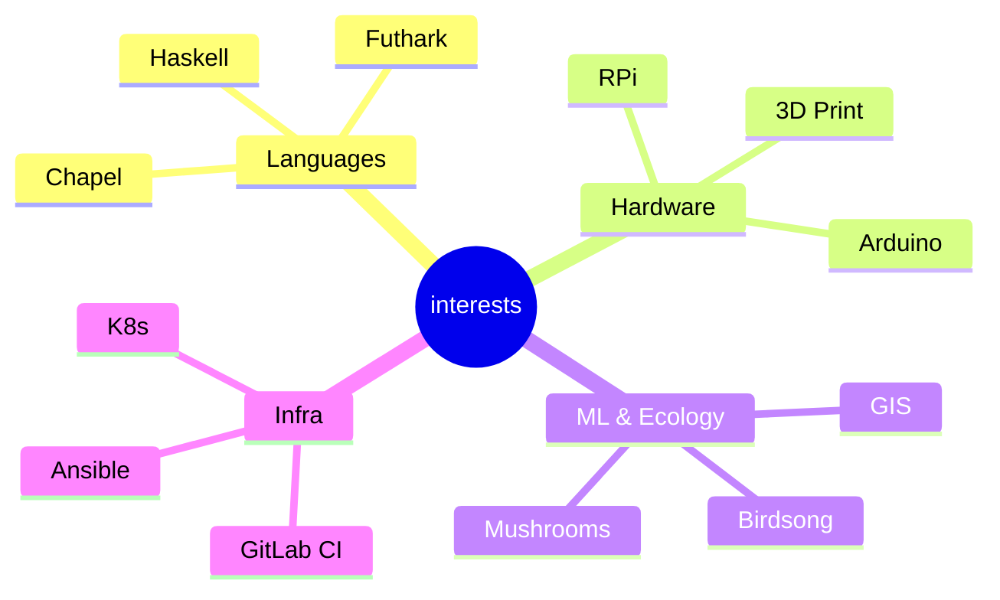

<table style="border:0">
<tr><td valign="top" width="60%">

### Jess Sullivan

I spent about a year completely offline — no LinkedIn, no blog, no social media.
Late 2023 through the end of 2024. An intentional disconnect.

I'm back now, rebuilding and picking up where I left off.

**Lewiston, ME** · [transscendsurvival.org](https://transscendsurvival.org) · Pro

</td><td valign="top" width="40%">

</td></tr>
</table>

<!--START_SECTION:blog-->
### Latest Blog Posts

*No recent posts loaded yet.*

[Read more ->](https://jesssullivan.github.io/blog)
<!--END_SECTION:blog-->

---

### Original Projects

<!--START_SECTION:repos-->

| Repo | Description | Lang |
|------|-------------|------|
| [GIS_Shortcuts](https://github.com/Jesssullivan/GIS_Shortcuts) | Jess's miscellaneous GIS notes and related tomfoolery  | R |
| [GloriousFlywheel](https://github.com/Jesssullivan/GloriousFlywheel) | Recursive IaC flywheel infrastructure system for Gitlab. | HCL |
| [tinyland-cleanup](https://github.com/Jesssullivan/tinyland-cleanup) | Cross-platform disk cleanup daemon with graduated thresholds | Go |
| [tinyland-kdbx](https://github.com/Jesssullivan/tinyland-kdbx) | Native KeePassXC KDBX reader with base58 transport | Python |
| [pp](https://github.com/Jesssullivan/pp) | Tinyland Lab shell dashboard with waifu integration | Go |
| [XoxdWM](https://github.com/Jesssullivan/XoxdWM) | Eye-gesture VR & BCI XWayland Emacs Window Manager for transhumans and cyborgs | Emacs Lisp |
| [hiberpower-ntfs](https://github.com/Jesssullivan/hiberpower-ntfs) | ASM2362 NVMe recovery experiments and research around FTL corruption | Zig |
| [Ansible-DAG-Harness](https://github.com/Jesssullivan/Ansible-DAG-Harness) | A disposable self-bootstrapping LangGraph DAG harness for "boxing up"Ansible iteration cycles in Gitlab | Python |
| [betterkvm](https://github.com/Jesssullivan/betterkvm) | The converged multiarch KVM for Tinyland NoneX86 contributions | Nix |
| [DarwinNicUtil](https://github.com/Jesssullivan/DarwinNicUtil) | Extensible TUI utility for dealing with out-of-band management / air gapped network devices, mostly for institutionalized Macs (ABR, Sophos, NIC precedence etc)  | Python |
| [RemoteJuggler](https://github.com/Jesssullivan/RemoteJuggler) | An identity management utility. Switch between multiple git identities with credential resolution, GPG + ssh signing, localized kdbx, be you a swarm of ten thousand clankers or even a human with a DE and a todolist. | Chapel |
| [pixelwise-research](https://github.com/Jesssullivan/pixelwise-research) | An experimental webGPU glyph compositor demonstration in Futhark | TypeScript |
| [gnucashr](https://github.com/Jesssullivan/gnucashr) | A high performance accounting and financial modeling R package for GNUCash | R |
| [quickchpl](https://github.com/Jesssullivan/quickchpl) | Simple Property-Based Testing for Chapel Language | Chapel |
| [tinyscale-mikrotik](https://github.com/Jesssullivan/tinyscale-mikrotik) | Very small tailscale container for CRS310 class switches | Shell |
| [aoc-2025](https://github.com/Jesssullivan/aoc-2025) | Example usage of quickchpl PBT Mason library for a few AoC 2025 problems in CI | Chapel |
| [tinywaffle](https://github.com/Jesssullivan/tinywaffle) |  | Dockerfile |
| [searchies](https://github.com/Jesssullivan/searchies) | hard AF searxng infra for uwu tinies | Jinja |
| [ts-caddy](https://github.com/Jesssullivan/ts-caddy) | Dreamhost DNS, Caddy, Tailscale, Dreamhost reverse proxy demo | Jinja |
| [HCI-notes](https://github.com/Jesssullivan/HCI-notes) | Misc. notes to share on switch to Proxmox from Harvester | HCL |
| [FastPhotoAPI](https://github.com/Jesssullivan/FastPhotoAPI) | An efficient, flexible, flask-based image server using Lanczos resampling  | Python |
| [timberbuddy](https://github.com/Jesssullivan/timberbuddy) | Archive of Control Package work for Amish Sawmill | TypeScript |
| [tetrahedron](https://github.com/Jesssullivan/tetrahedron) | Application for tetrahedron.gay mental health social service | Svelte |
| [AccuWixReport](https://github.com/Jesssullivan/AccuWixReport) | A command line utility generating monthly transaction & superlative financial reports - migration between Acuity / Wix | Python |
| [Jess-AOC-2023](https://github.com/Jesssullivan/Jess-AOC-2023) | Jess's solutions to the 2023 Advent of Code | Python |
| [TurkeyProbe](https://github.com/Jesssullivan/TurkeyProbe) | for probing the Turkey | C++ |
| [MerlinAI-Interpreters](https://github.com/Jesssullivan/MerlinAI-Interpreters) | Experiments, interpreter implementations, demos, data ingress tangents and lots of notes for birdsong identification  machine learning | TypeScript |
| [IntroTypeScript](https://github.com/Jesssullivan/IntroTypeScript) | Learn how to write a command line utility of your own in pure modern TypeScript | TypeScript |
| [NyxBox](https://github.com/Jesssullivan/NyxBox) | Posh & Fosh Litterbox |  |
| [IG-3DP-Profiles](https://github.com/Jesssullivan/IG-3DP-Profiles) | Ithaca Generator 3d printer profiles and notes |  |
| [TarrytownNY-Notes](https://github.com/Jesssullivan/TarrytownNY-Notes) |  | Jupyter Notebook |
| [DLA-Flask](https://github.com/DLA-Makerspace/DLA-Flask) | Lightweight & responsive web dashboard application for DLA Makerspace | Jinja |
| [MembershipWorks-Migration](https://github.com/Jesssullivan/MembershipWorks-Migration) |  | Jupyter Notebook |
| [misc](https://github.com/Jesssullivan/misc) |  | Jupyter Notebook |

### FOSS Contributions

| Fork | What |
|------|------|
|  | :boom::computer::boom: A data-parallel functional programming language |
|  | Materials and examples for using Futhark with WebGPU |
|  | Freenet development standard library |
|  | a Productive Parallel Programming Language |
|  | [MIRROR] unofficial implementation of Dante protocol (Audio over IP) |
|  | SearXNG is a free internet metasearch engine which aggregates results from various search services and databases. Users are neither tracked nor profiled. |
|  | Skeleton is an adaptive design system powered by Tailwind CSS. |
|  | BrainFlow is a library intended to obtain, parse and analyze EEG, EMG, ECG and other kinds of data from biosensors |
|  | KeePassXC is a cross-platform community-driven port of the Windows application “KeePass Password Safe”. |
|  | Free and Affordable, Virtual Reality Eye Tracking Platform. |
|  | Making SvelteKit forms a pleasure to use! |
|  | Package registry for mason, Chapel's package manager |
|  | X protocol Emacs Lisp Binding |
|  | Enable dynamic and seamless Kubernetes multi-cluster topologies |
|  | A new lightweight, hybrid routing mesh protocol for packet radios |
|  | Fork of elinks |
|  | Apache Solr open-source search software |
|  | Go library and CLIs for working with container registries |
|  | A sub-micrometer 3D motion control plattform. |
|  | The docker-compose files for setting up a SearXNG instance with docker. |
|  | A blazing-fast, memory-safe neural network library for Rust that brings the power of FANN to the modern world. |
|  | minimal yet functional neovim |
|  | Escalation of Privilege to the root through sudo binary with chroot option. CVE-2025-32463 |
|  |  |
|  | Build Caddy with plugins |
|  | Run and supervise background processes from Caddy |
|  |  |
|  |  |
|  | Fast and extensible multi-platform HTTP/1-2-3 web server with automatic HTTPS |
|  | Generic Non-Planar Slicer |
|  | A caddy plugin to place Anubis (anti-AI scrapper) directly within caddy as a middleware. |
|  | A Python package for accessing Solr indexes via Claude Code |
|  |  |
|  | NanoKVM: Affordable, Multifunctional, Nano RISC-V IP-KVM |
|  | The leader of the pack - control multiple distributed instances of Wolf in K8S |
|  | Command-line program to download videos from YouTube.com and other video sites |
|  | collection of ansible roles and playbooks to enable self-hosters full control of their infrastructure |
|  | A simple framework for building customized OpenWRT images with additional options for virtual machine conversion & embedded parition resizing |
|  | The official website of the Rocky Linux project. |
|  | Klipper is a 3d-printer firmware |
|  | print in docker - Deploy a containerized Klipper Stack for your 3D Printer |
|  | Email and password example with 2FA and WebAuthn in SvelteKit |
|  | MOD Audio for the desktop |
|  | A SLM Toolhead using 3628 Fans and Chube (Formerly Called Jaguar) |
|  | Traccar Client for Android |
|  | Windows inside a Docker container. |
|  | This is a GUI for the Neural Amp Modeler LV2 plugin |
|  | A Linux client for your iCloud Notes service |
|  | NTLM reverse proxy transport module for Caddy |
|  | Ithaca Generator 3d printer profiles and notes |
|  | Machine learning tool-set for Paperspace VMs |
|  | High-precision indoor positioning framework, version 3. |
|  |  |
|  | Python Scripts for Conical GCode Slicing |
|  | A vector tile, terrain and city 3d model builder and exporter |
|  |  |
|  | Web catalogue of LEGO® parts for 3D printing |
|  | The minimal amount of CSS to replicate the GitHub Markdown style |
|  | Kelp is a web-based GUI for SeaweedFS, meant to emulate the look and feel of a native file explorer. |
|  |  |
|  | An open source Vagrant configuration for developing with WordPress |
|  | A JavaScript framework for creating user interfaces to Solr. |

*Last updated: 2026-02-10 03:14 UTC*
<!--END_SECTION:repos-->

---

GitHub Stats

---

*This README is updated daily by a [GitHub Action](.github/workflows/update-readme.yml).*

