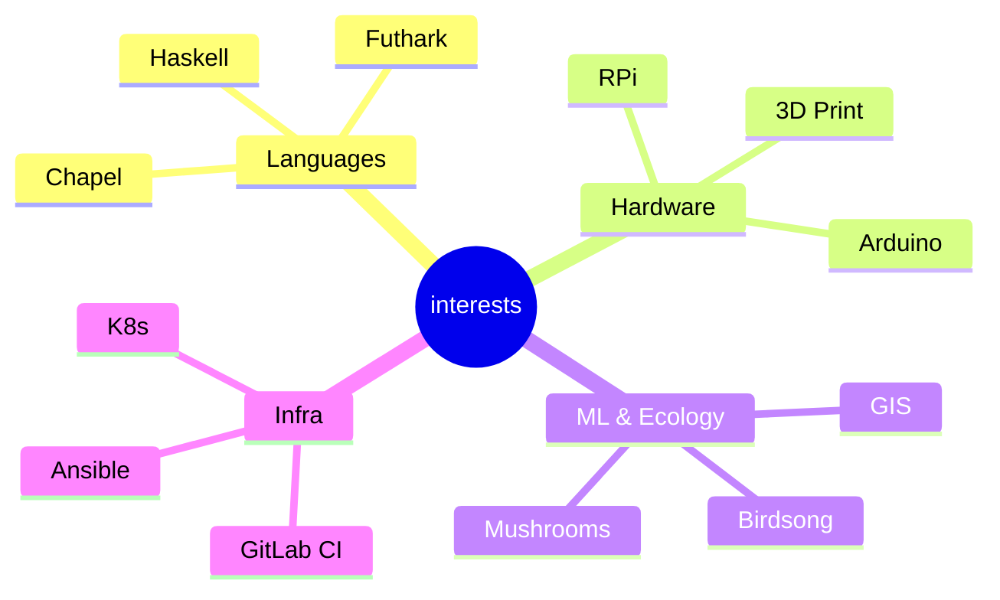

<table style="border:0">
<tr><td valign="top" width="60%">

### Jess Sullivan

I spent about a year completely offline — no LinkedIn, no blog, no social media.
Late 2023 through the end of 2024. An intentional disconnect.

I'm back now, rebuilding and picking up where I left off.

**Lewiston, ME** · [transscendsurvival.org](https://transscendsurvival.org) · Pro

</td><td valign="top" width="40%">

</td></tr>
</table>

---

### Original Projects

<!--START_SECTION:repos-->

| Repo | Description | Lang |
|------|-------------|------|
| [quickchpl](https://github.com/Jesssullivan/quickchpl) | Property-Based Testing for Chapel | Chapel |
| [GloriousFlywheel](https://github.com/Jesssullivan/GloriousFlywheel) | Recursive IaC flywheel for GitLab | Shell |
| [XoxdWM](https://github.com/Jesssullivan/XoxdWM) | Eye-gesture VR & BCI XWayland Emacs WM | Emacs Lisp |
| [RemoteJuggler](https://github.com/Jesssullivan/RemoteJuggler) | Multi-identity git credential management | Shell |
| [gnucashr](https://github.com/Jesssullivan/gnucashr) | High-perf accounting R package for GNUCash | R |
| [pixelwise-research](https://github.com/Jesssullivan/pixelwise-research) | WebGPU glyph compositor in Futhark | Futhark |
| [MerlinAI-Interpreters](https://github.com/Jesssullivan/MerlinAI-Interpreters) | Birdsong ML identification | Python |
| [Arduino_Coil_Winder](https://github.com/Jesssullivan/Arduino_Coil_Winder) | Open-source stepper hardware | C++ |
| [clipi](https://github.com/Jesssullivan/clipi) | Raspberry Pi automation tools | Python |
| [mo-image-identifier](https://github.com/Jesssullivan/mo-image-identifier) | Mushroom identification for MushroomObserver | Python |
| [Ansible-DAG-Harness](https://github.com/Jesssullivan/Ansible-DAG-Harness) | LangGraph DAG harness for Ansible | Python |

<!--END_SECTION:repos-->

### FOSS Contributions

| Fork | What |
|------|------|
|  | Parallel programming language |
|  | GPU programming language |
|  | Privacy-respecting search engine |
|  | UI toolkit for Svelte |
|  | Password manager |
|  | Biosensor data library |
|  | Apache search platform |
|  | Mesh networking |
|  | VR eye tracking |

---

GitHub Stats

---

*This README is updated daily by a [GitHub Action](.github/workflows/update-readme.yml).*

*Last manual edit: 2026-02-09*
