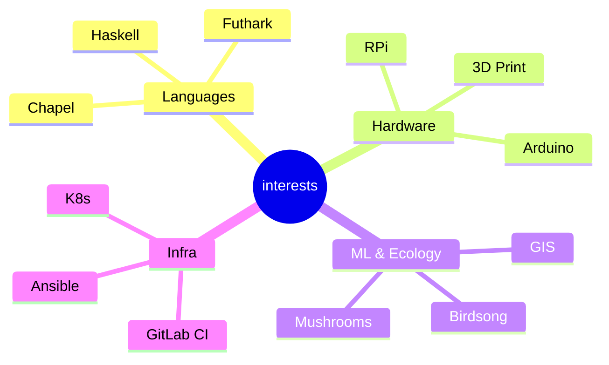

<table style="border:0">
<tr><td valign="top" width="60%">

### Jess Sullivan

I spent about a year completely offline — no LinkedIn, no blog, no social media.
Late 2023 through the end of 2024. An intentional disconnect.

I'm back now, rebuilding and picking up where I left off.

**Lewiston, ME** · [transscendsurvival.org](https://transscendsurvival.org) · Pro

</td><td valign="top" width="40%">

</td></tr>
</table>

<!--START_SECTION:activity-->
**Currently working on:** [GloriousFlywheel](https://github.com/Jesssullivan/GloriousFlywheel)
  Recursive IaC flywheel infrastructure system for Gitlab.
  *HCL · last push today*
<!--END_SECTION:activity-->

<!--START_SECTION:blog-->
### Latest Blog Posts

- [Hello World](https://transscendsurvival.org/blog/hello-world) — *Feb 09, 2026*
- [What have I been up to these last few months?](https://transscendsurvival.org/blog/what-have-i-been-up-to-these-last-few-months) — *May 22, 2024*
- [I wrote a mutual aid mental health service](https://transscendsurvival.org/blog/i-wrote-a-mutual-aid-mental-health-service) — *Feb 22, 2024*

[Read more ->](https://jesssullivan.github.io/blog)
<!--END_SECTION:blog-->

---

### Original Projects

<!--START_SECTION:repos-->

| Repo | Description | Lang |
|------|-------------|------|
| [GloriousFlywheel](https://github.com/Jesssullivan/GloriousFlywheel) | Recursive IaC flywheel infrastructure system for Gitlab. | HCL |
| [GIS_Shortcuts](https://github.com/Jesssullivan/GIS_Shortcuts) | Jess's miscellaneous GIS notes and related tomfoolery  | R |
| [tinyland-cleanup](https://github.com/Jesssullivan/tinyland-cleanup) | Cross-platform disk cleanup daemon with graduated thresholds | Go |
| [tinyland-kdbx](https://github.com/Jesssullivan/tinyland-kdbx) | Native KeePassXC KDBX reader with base58 transport | Python |
| [pp](https://github.com/Jesssullivan/pp) | Tinyland Lab shell dashboard with waifu integration | Go |
| [XoxdWM](https://github.com/Jesssullivan/XoxdWM) | Eye-gesture VR & BCI XWayland Emacs Window Manager for transhumans and cyborgs | Emacs Lisp |
| [hiberpower-ntfs](https://github.com/Jesssullivan/hiberpower-ntfs) | ASM2362 NVMe recovery experiments and research around FTL corruption | Zig |
| [Ansible-DAG-Harness](https://github.com/Jesssullivan/Ansible-DAG-Harness) | A disposable self-bootstrapping LangGraph DAG harness for "boxing up"Ansible iteration cycles in ... | Python |
| [betterkvm](https://github.com/Jesssullivan/betterkvm) | The converged multiarch KVM for Tinyland NoneX86 contributions | Nix |
| [DarwinNicUtil](https://github.com/Jesssullivan/DarwinNicUtil) | Extensible TUI utility for dealing with out-of-band management / air gapped network devices, most... | Python |
| [RemoteJuggler](https://github.com/Jesssullivan/RemoteJuggler) | An identity management utility. Switch between multiple git identities with credential resolution... | Chapel |
| [pixelwise-research](https://github.com/Jesssullivan/pixelwise-research) | An experimental webGPU glyph compositor demonstration in Futhark | TypeScript |
| [gnucashr](https://github.com/Jesssullivan/gnucashr) | A high performance accounting and financial modeling R package for GNUCash | R |
| [quickchpl](https://github.com/Jesssullivan/quickchpl) | Simple Property-Based Testing for Chapel Language | Chapel |
| [tinyscale-mikrotik](https://github.com/Jesssullivan/tinyscale-mikrotik) | Very small tailscale container for CRS310 class switches | Shell |
| [aoc-2025](https://github.com/Jesssullivan/aoc-2025) | Example usage of quickchpl PBT Mason library for a few AoC 2025 problems in CI | Chapel |
| [tinywaffle](https://github.com/Jesssullivan/tinywaffle) | Waffle-iron deployment orchestrator for Tinyland container workloads | Dockerfile |
| [searchies](https://github.com/Jesssullivan/searchies) | hard AF searxng infra for uwu tinies | Jinja |
| [ts-caddy](https://github.com/Jesssullivan/ts-caddy) | Dreamhost DNS, Caddy, Tailscale, Dreamhost reverse proxy demo | Jinja |
| [HCI-notes](https://github.com/Jesssullivan/HCI-notes) | Misc. notes to share on switch to Proxmox from Harvester | HCL |

*...and [11 more](https://github.com/Jesssullivan?tab=repositories&type=source)*

### FOSS Contributions

| Fork | Upstream |
|------|----------|
|  | [teodly/inferno](https://github.com/teodly/inferno) |
|  | [searxng/searxng](https://github.com/searxng/searxng) |
|  | [skeletonlabs/skeleton](https://github.com/skeletonlabs/skeleton) |
|  | [liqotech/liqo](https://github.com/liqotech/liqo) |
|  | [meshcore-dev/MeshCore](https://github.com/meshcore-dev/MeshCore) |
|  | [apache/solr](https://github.com/apache/solr) |
|  | [google/go-containerregistry](https://github.com/google/go-containerregistry) |
|  | [0x23/MicroManipulatorStepper](https://github.com/0x23/MicroManipulatorStepper) |
|  | [ruvnet/ruv-FANN](https://github.com/ruvnet/ruv-FANN) |
|  | [pr0v3rbs/CVE-2025-32463_chwoot](https://github.com/pr0v3rbs/CVE-2025-32463_chwoot) |
|  | [Jesssullivan/IG-3DP-Profiles](https://github.com/Jesssullivan/IG-3DP-Profiles) |
|  | [diku-dk/futhark](https://github.com/diku-dk/futhark) |
|  | [diku-dk/futhark-webgpu](https://github.com/diku-dk/futhark-webgpu) |
|  | [freenet/freenet-stdlib](https://github.com/freenet/freenet-stdlib) |
|  | [chapel-lang/chapel](https://github.com/chapel-lang/chapel) |

*...and [47 more forks](https://github.com/Jesssullivan?tab=repositories&type=fork)*

*Last updated: 2026-02-10 06:35 UTC*
<!--END_SECTION:repos-->

---

GitHub Stats

---

*This README is updated daily by a [GitHub Action](.github/workflows/update-readme.yml).*

