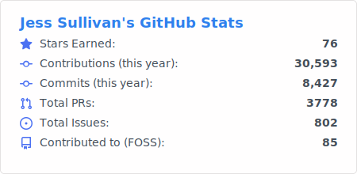
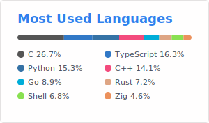
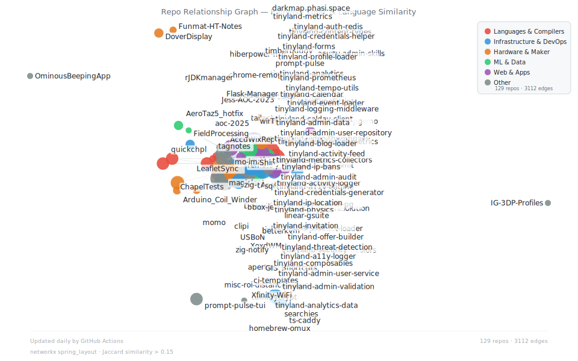

[![Typing SVG](https://readme-typing-svg.demolab.com?font=Fira+Code&pause=1000&color=36BCF7&center=true&vCenter=true&width=800&lines=Full+Stack+Engineer+%7C+DevSecOps+%7C+Agent+Orchestration+%7C+ML%2FHPC;Chapel+%7C+Haskell+%7C+Python+%7C+TypeScript+%7C+SvelteKit+%7C+Go;C%2B%2B+%7C+R+%7C+Zig+%7C+Nix+%7C+Rust+SIMD+%7C+Futhark+%7C+Emacs+Lisp;Computer+Vision+%7C+Fine-Grained+Classification+%7C+WASM+Inference;K8s+%7C+Ansible+%7C+GitLab+CI+%7C+Apache+Solr+%7C+Bazel;Global+DNS+%7C+k8gb+%7C+CoreDNS+%7C+NAT+Punching+%7C+MetalLB;GIS+%7C+Cartography+%7C+Remote+Sensing+%7C+R+%7C+QGIS;LangChain+%7C+LangGraph+%7C+pgvector+%7C+vLLM+%7C+Custom+Embeddings;Multilocal+Orchestration+%7C+RKE2+%7C+Rancher+%7C+OpenTofu;3D+Printing+%7C+OpenSCAD+%7C+Fusion+360+%7C+Arduino+%7C+RPi;TensorFlow+%7C+NumPy+%7C+Pandas+%7C+Flask+%7C+Docker+%7C+WebAssembly;9-String+Guitar+%7C+12-String+Acoustic+%7C+Rotary+Yamaha+Organ;ACME+Certs+%7C+SAML+%7C+KeePassXC+%7C+SearXNG+%7C+Caddy;Photography+%7C+Mass+Audubon+%7C+Goth+Nights+%7C+Bagel+Baker;Merlin+Sound+ID+%7C+Birder+%7C+Musician+%7C+Baker+%7C+Bard)](https://git.io/typing-svg)

<table>
<tr>
<td valign="top" width="60%">

### Jess Sullivan / xoxd ^w^

Full stack **engineer**, ***musician***, and *birdwatcher* based in ~~ipv6 squat space~~ New England (Lewiston, ME + Boston, MA). 🏡

I spent about a year completely offline — no social media, no blog, no public sites or public development, no Linkedin, nothing.
 I'm back to building in the open on github and codeberg, though I am still largely airgapped from social media.

I build planet scale infrastructure tooling for fun, architect and enchant digital automata, hack upon compilers :thinking: I love learning new languages, futzing around with hardware, occasionally attempt to run businesses and maintain a *lot* of fun projects here and elsewhere.  

</td>
<td valign="top" width="40%">

</td>
</tr>
<tr>
<td align="center" valign="middle">

</td>
<td valign="middle">

> **As of 2025, I'm much more active in Tinyland with my robots** — find me at [`jesssullivan`](https://gitlab.com/jesssullivan) and [`jsullivan2_bates`](https://gitlab.com/jsullivan2_bates)

</td>
</tr>
</table>

---

### GitHub Activity

<picture>
  <source media="(prefers-color-scheme: dark)" srcset="github-stats-dark.svg" />
  <source media="(prefers-color-scheme: light)" srcset="github-stats.svg" />
  
</picture>

<picture>
  <source media="(prefers-color-scheme: dark)" srcset="top-langs-dark.svg" />
  <source media="(prefers-color-scheme: light)" srcset="top-langs.svg" />
  
</picture>

<picture>
  <source media="(prefers-color-scheme: dark)" srcset="github-snake-dark.svg" />
  <source media="(prefers-color-scheme: light)" srcset="github-snake.svg" />
  
</picture>

### Repository Similarity Graph

<picture>
  <source media="(prefers-color-scheme: dark)" srcset="repo-graph-dark.svg" />
  <source media="(prefers-color-scheme: light)" srcset="repo-graph.svg" />
  
</picture>

*Jaccard similarity of repository language distributions. [View Mermaid version](repo-graph.mmd)*

---

### Experience & Ventures

<table>
<tr>
<td width="50%" valign="top">

**Systems Analyst (DevSecOps)** — Bates College *(2024–Present)*
- Legacy modernization, bespoke Ansible extensions, roles & plugins
- Apache Solr, ACME cert management, SAML integrations
- GitLab AutoDevOps, RKE2 + Rancher, promoter of IaC practices :tm:
- Orchestration, packaging & tooling work (Haskell + Python, QuickCheck, Cabal, FPM)

**CV/ML Software Engineer** — Macaulay Library *(2018–2022)*
- Developed & launched [Merlin Sound ID](https://merlin.allaboutbirds.org/) & The Machine Learning Blog
- Fine-grained ML annotation tools for audio classification
- Internal classification & model evaluation web APIs
- Python (TensorFlow, NumPy, Pandas), Flask, TypeScript, Docker, WASM

**Fabrication Lab Manager** — Cornell CALS *(2021–2022)*
- Rapid fabrication curricula for Landscape Architecture students & faculty
- OpenSCAD, Fusion 360, C++ tiler development

</td>
<td width="50%" valign="top">

**xoxd.ai** *(2024–Present)*
- Massively parallel, provable, **ownable** agent infrastructure
- Seeking funding, stealthmode

**Tinyland.dev, Inc** *(2024–Present)*
- Funded hackerspace initiative, stealthmode

**Kitten Spit Labs** *(2022–Present)*
- Ultrasonic phantom network gel synthesis. *currently on mfg. pause*

**Columbari.us LLC** *(2017–2021)*
- Independent Gov. contractor in GIS & ML

**Moonlight Coworking LLC** *(2024)*
- Shelved rapidfab / HPC hackerspace initiative in NY

Clients:

</td>
</tr>
</table>

### Community

- **RESF Community Member** — Rocky Enterprise Linux Foundation
- **First Fellow** — D&M Makerspace, Plymouth State University *(2017–2020)*
- Taught Advanced GIS Programming & Intro to Electromechanics at PSU
- **Membership Chair & 3D Printing Captain** — Ithaca Generator *(2020–2022)*
- **COVID-19 PPE manufacturing coordination** across New England makerspaces

### Beyond Code

**Photography**

Cut my teeth professionally with world-renowned aerial photographer Alex MacLean and Mike Nyman Wedding Photography before going into business as J.S. Event Photography. Wrote and taught the youth photography curriculum at Joppa Flats and Drumlin Farm Mass Audubon Wildlife Sanctuaries — programs still going strong. Work featured at Celebrate Newton, Newton Public Library, Pease Public Library, Newtonville Cinema, Newton Camera Club, Broadmoor Wildlife Sanctuary, and in the Newton Tab. Did my own printing on a heavily modified inkjet printer. Completely burnt out from photography by end of 2017, sold all my gear by the end of college.

**Music**

20+ years of guitar — currently play a custom 9-string electric made for me in NH and a 12-string acoustic. 25+ years of piano/organ — primarily on a rotary Yamaha organ these days.

> *"If there were no computers I'd probably be a baker, a minstrel or a bard."*

**Hospitality**

Evening bartender & event organizer at Modern Alchemy Game Bar in Ithaca — organized monthly Goth Nights, art shows & private events. Bartender at The Downstairs Listening Room & Tavern and The Watershed in New York. Casual bagel baker at Tandem Bagel Co in Northampton, MA (Spring 2024).

---

<!--START_SECTION:blog-->
### Latest Blog Posts

- [Week Notes: Indeterminism, Passkeys, and Spring](https://transscendsurvival.org/blog/week-notes-indeterminism-passkeys-and-spring) — *Mar 21, 2026*
- [WinRM Quotas, Plugin Confusion, and Why PSRP Has Been the Answer Since 2018](https://transscendsurvival.org/blog/winrm-quotas-hidden-plugin-layers-and-why-psrp-has-been-the-answer-since-2018) — *Mar 13, 2026*
- [Updated Resume & CV — March 2026](https://transscendsurvival.org/blog/updated-resume-and-cv) — *Mar 12, 2026*

[Read more ->](https://transscendsurvival.org/blog)
<!--END_SECTION:blog-->

---

### Original Projects

<!--START_SECTION:repos-->

<strong>Languages & Compilers</strong> (7)

- [**scheduling-kit**](https://github.com/Jesssullivan/scheduling-kit) — Backend-agnostic scheduling system with Acuity, CalCom, and homegrown adapters *(TypeScript · 4 days ago)*
- [**pixelwise-research**](https://github.com/Jesssullivan/pixelwise-research) — WIP, danger be lurking!  Novel glyph compositor research with Futhark webGPU investigating vector... *(TypeScript · 1 ★ · Feb 2026)*
- [**quickchpl**](https://github.com/Jesssullivan/quickchpl) — Simple Property-Based Testing for Chapel Language *(Chapel · 2 ★ · Jan 2026)*
- [**aoc-2025**](https://github.com/Jesssullivan/aoc-2025) — Example usage of quickchpl PBT Mason library for a few AoC 2025 problems in CI *(Chapel · Jan 2026)*
- [**Jess-AOC-2023**](https://github.com/Jesssullivan/Jess-AOC-2023) — Jess's solutions to the 2023 Advent of Code *(Python · Dec 2023)*
- [**tagnotes**](https://github.com/Jesssullivan/tagnotes) — Google Calendar API with Chapel & Python *(Chapel · Sep 2019)*
- [**ChapelTests**](https://github.com/Jesssullivan/ChapelTests) — Dupe Checking, String Iteration, Parallel Evaluation in Chapel-language & Python3 *(Chapel · Sep 2019)*

<strong>Infrastructure & DevOps</strong> (13)

- [**tailnet-acl**](https://github.com/Jesssullivan/tailnet-acl) — Dhall-typed Tailscale ACL policy + OpenTofu infrastructure *(Dhall · today)*
- [**tummycrypt**](https://github.com/Jesssullivan/tummycrypt) — WIP!  under active development.  FOSS self-hosted odrive replacement — file sync with E2E encrypt... *(Rust · 3 ★ · 2 days ago)*
- [**winrm-molecule-forkbomb-demo**](https://github.com/Jesssullivan/winrm-molecule-forkbomb-demo) — Fast and dirty demo of winrm molecule fork bomb behavior; when trying to go fast goes wrong *(Jinja · 2 weeks ago)*
- [**tinyland-cleanup**](https://github.com/Jesssullivan/tinyland-cleanup) — Cross-platform disk cleanup daemon with graduated thresholds — Go, Nix, systemd/launchd *(Go · Mar 2026)*
- [**aperture-bootstrap**](https://github.com/Jesssullivan/aperture-bootstrap) — Bootstrap Tailscale Aperture config from tagged devices using tsnet — How to resolve WhoIs identi... *(Go · Feb 2026)*
- [**tinyland-kdbx**](https://github.com/Jesssullivan/tinyland-kdbx) — Native KeePassXC KDBX reader with base58 transport *(Python · Feb 2026)*
- [**Ansible-DAG-Harness**](https://github.com/Jesssullivan/Ansible-DAG-Harness) — A disposable self-bootstrapping LangGraph DAG harness for boxing up Ansible iteration cycles in G... *(Python · Feb 2026)*
- [**DarwinNicUtil**](https://github.com/Jesssullivan/DarwinNicUtil) — Extensible TUI utility for dealing with out-of-band management / air gapped network devices, most... *(Python · 1 ★ · Feb 2026)*
- [**tinyscale-mikrotik**](https://github.com/Jesssullivan/tinyscale-mikrotik) — Very small tailscale container for CRS310 class switches *(Shell · Jan 2026)*
- [**searchies**](https://github.com/Jesssullivan/searchies) — hard AF searxng infra for uwu tinies *(Jinja · Apr 2025)*
- [**ts-caddy**](https://github.com/Jesssullivan/ts-caddy) — Dreamhost DNS, Caddy, Tailscale, Dreamhost reverse proxy demo *(Jinja · 1 ★ · Mar 2025)*
- [**HCI-notes**](https://github.com/Jesssullivan/HCI-notes) — Misc. notes to share on switch to Proxmox from Harvester *(HCL · Feb 2025)*
- [**LeafletSync**](https://github.com/Jesssullivan/LeafletSync) — Chindōgu utility prompt & CLI for fetching private releases & files from GitHub & BitBucket *(Shell · Jan 2021)*

<strong>Hardware & Maker</strong> (10)

- [**hiberpower-ntfs**](https://github.com/Jesssullivan/hiberpower-ntfs) — ASM2362 NVMe recovery experiments and research around FTL corruption *(Zig · 5 ★ · 3 days ago)*
- [**zig-ctap2**](https://github.com/Jesssullivan/zig-ctap2) — Hermetic CTAP2/FIDO2 library in Zig — direct USB HID for YubiKey/security keys, no Apple entitlem... *(Zig · 5 days ago)*
- [**zig-crypto**](https://github.com/Jesssullivan/zig-crypto) — Portable cryptographic primitives in Zig — SHA-256, HMAC, AES-CBC, PBKDF2, CSPRNG. C FFI for cros... *(Zig · 6 days ago)*
- [**XoxdWM**](https://github.com/Jesssullivan/XoxdWM) — Eye-gesture VR & BCI XWayland Emacs Window Manager for transhumans and cyborgs *(Emacs Lisp · 2 weeks ago)*
- [**TurkeyProbe**](https://github.com/Jesssullivan/TurkeyProbe) — for probing the Turkey *(C++ · Nov 2023)*
- [**DoverDisplay**](https://github.com/Jesssullivan/DoverDisplay) — A stylish enclosure for the Xilinx / Digilent Genesys 2 FPGA + display panel *(1 ★ · Jan 2021)*
- [**Arduino_Coil_Winder**](https://github.com/Jesssullivan/Arduino_Coil_Winder) — Investigating open-source stepper hardware for coil winding  *(C++ · 7 ★ · Dec 2020)*
- [**momo**](https://github.com/Jesssullivan/momo) — @ D&M Makerspace *(C++ · Nov 2020)*
- [**AeroTaz5_hotfix**](https://github.com/Jesssullivan/AeroTaz5_hotfix) — @ D&M Makerspace *(C++ · Jul 2020)*
- [**Funmat-HT-Notes**](https://github.com/Jesssullivan/Funmat-HT-Notes) — misc notes, files for Funmat HT (late, pre-enhanced) 3d printer *(Jun 2020)*

<strong>ML & Data</strong> (6)

- [**MerlinAI-Interpreters**](https://github.com/Jesssullivan/MerlinAI-Interpreters) — Experiments, interpreter implementations, demos, data ingress tangents and lots of notes for bird... *(TypeScript · 4 ★ · 2 days ago)*
- [**gnucashr**](https://github.com/Jesssullivan/gnucashr) — A high performance accounting and financial modeling R package and MCP tool surface for GNUCash, ... *(C++ · 1 ★ · 2 weeks ago)*
- [**AccuWixReport**](https://github.com/Jesssullivan/AccuWixReport) — A command line utility generating monthly transaction & superlative financial reports - migration... *(Python · Jan 2024)*
- [**Shiny-Apps**](https://github.com/Jesssullivan/Shiny-Apps) — Old R / Shiny KML Geoprocessing Tools & Deployment Framework Ideas *(R · 1 ★ · Feb 2021)*
- [**FieldProcessing**](https://github.com/Jesssullivan/FieldProcessing) — Processing Bird Point Count data.    *(R · Nov 2019)*
- [**rJDKmanager**](https://github.com/Jesssullivan/rJDKmanager) — Quickly & forcefully manage extra JDKs in base R *(R · Nov 2019)*

<strong>Web & Apps</strong> (11)

- [**acuity-middleware**](https://github.com/Jesssullivan/acuity-middleware) — Why pay for an API to rebuild a closed source wizard when you *are* a wizard?  Playwright-based M... *(TypeScript · 4 days ago)*
- [**acuity-admin-skills**](https://github.com/Jesssullivan/acuity-admin-skills) — Agent automation skills for Acuity Scheduling admin panel leveraging tinyland calendaring stack  *(TypeScript · 1 week ago)*
- [**LA-Mesh**](https://github.com/Jesssullivan/LA-Mesh) — LoRa infrastructure projects for Southern Maine. *(Svelte · Feb 2026)*
- [**GIS_Shortcuts**](https://github.com/Jesssullivan/GIS_Shortcuts) — Jess's miscellaneous GIS notes and related tomfoolery  *(R · 1 ★ · Feb 2026)*
- [**FastPhotoAPI**](https://github.com/Jesssullivan/FastPhotoAPI) — An efficient, flexible, flask-based image server using Lanczos resampling  *(Python · 1 ★ · Dec 2024)*
- [**timberbuddy**](https://github.com/Jesssullivan/timberbuddy) — Archive of Control Package work for Amish Sawmill *(TypeScript · 1 ★ · Dec 2024)*
- [**tetrahedron**](https://github.com/Jesssullivan/tetrahedron) — Application for tetrahedron.gay mental health social service *(Svelte · Feb 2024)*
- [**IntroTypeScript**](https://github.com/Jesssullivan/IntroTypeScript) — Learn how to write a command line utility of your own in pure modern TypeScript *(TypeScript · Nov 2022)*
- [**USBoN**](https://github.com/Jesssullivan/USBoN) — Let's Automate All The Things *(Python · 6 ★ · Sep 2021)*
- [**squirrel-leaflet-annotation**](https://github.com/Jesssullivan/squirrel-leaflet-annotation) — leaflet audio annotator for the squirrels & munks *(TypeScript · Feb 2021)*
- [**bbox-jest-puppeteer**](https://github.com/Jesssullivan/bbox-jest-puppeteer) — Demo Jest + Puppeteer environment for web UI evaluation *(JavaScript · Feb 2021)*

<strong>Other</strong> (14)

- [**tinyland-huskycat**](https://github.com/Jesssullivan/tinyland-huskycat) — A multimodal, deterministic verification middleware for unsupervised, domain-driven iteration *(Python · today)*
- [**zig-keychain**](https://github.com/Jesssullivan/zig-keychain) — Portable keychain/secrets abstraction in Zig — macOS SecItem + Linux libsecret. C FFI for cross-p... *(Python · 5 days ago)*
- [**zig-notify**](https://github.com/Jesssullivan/zig-notify) — Portable notification abstractions — macOS UNUserNotificationCenter + Linux libnotify/D-Bus. C FF... *(Python · 6 days ago)*
- [**tinyclaw**](https://github.com/Jesssullivan/tinyclaw) — Efficient verifiable fork of picoclaw for reasoning over recursive development cadence   *(Go · Mar 2026)*
- [**tinyland-hexstrunk**](https://github.com/Jesssullivan/tinyland-hexstrunk) — Formal, tracable, auditable tool surface for playing the bad guy *(Python · Feb 2026)*
- [**prompt-pulse-tui**](https://github.com/Jesssullivan/prompt-pulse-tui) — Ratatui terminal dashboard for prompt-pulse system monitoring *(Rust · Feb 2026)*
- [**IG-3DP-Profiles**](https://github.com/Jesssullivan/IG-3DP-Profiles) — Ithaca Generator 3d printer profiles and notes *(Sep 2022)*
- [**chrome-remote-desktop-budgie**](https://github.com/Jesssullivan/chrome-remote-desktop-budgie) — Fully automated patching for Chrome Remote Desktop on Ubuntu Budgie & GNOME-based desktop environ... *(Python · 6 ★ · Sep 2021)*
- [**OminousBeepingApp**](https://github.com/Jesssullivan/OminousBeepingApp) — Rick and Morty S4E2 *(Swift · Jul 2021)*
- [**mo-image-identifier**](https://github.com/Jesssullivan/mo-image-identifier) — Image-based mushroom identification experiments for MushroomObserver.org *(Python · 2 ★ · Mar 2021)*
- [**misc-roi-distance-notes**](https://github.com/Jesssullivan/misc-roi-distance-notes) — naive distance measurements with opencv *(Python · Jan 2021)*
- [**clipi**](https://github.com/Jesssullivan/clipi) — Raspberry Pi automation tools and notes for Debian distros- emulate, organize, burn & manage *(Python · Oct 2020)*
- [**Flask-Manager**](https://github.com/Jesssullivan/Flask-Manager) — Manage multiple single-thread web applications with Flask *(Python · Dec 2019)*
- [**Xfinity-WiFi**](https://github.com/Jesssullivan/Xfinity-WiFi) — Python/Selenium *(Python · Aug 2019)*

*...and [1 more](https://github.com/Jesssullivan?tab=repositories&type=source)*

<strong>tinyland-inc / Infrastructure & DevOps</strong> (3)

- [**GloriousFlywheel**](https://github.com/tinyland-inc/GloriousFlywheel) — Recursive IaC flywheel infrastructure system — Nix, Bazel, Civo K8s, Attic cache *(HCL · 1 ★ · 2 days ago)*
- [**betterkvm**](https://github.com/tinyland-inc/betterkvm) — The converged multiarch KVM for Tinyland NoneX86 contributions *(Just · Feb 2026)*
- [**tinyland-infra**](https://github.com/tinyland-inc/tinyland-infra) — Demo - Tinyland IaC overlay for GloriousFlywheel — deploys Nix binary cache, GitLab runners, and ... *(HCL · Feb 2026)*

<strong>tinyland-inc / Web & Apps</strong> (2)

- [**tinyland-auth-redis**](https://github.com/tinyland-inc/tinyland-auth-redis) — Redis storage adapter for @tummycrypt/tinyland-auth (Upstash) *(TypeScript · 4 days ago)*
- [**tinyland-auth-pg**](https://github.com/tinyland-inc/tinyland-auth-pg) — PostgreSQL storage adapter for @tummycrypt/tinyland-auth (Neon + Drizzle) *(TypeScript · 4 days ago)*

<strong>tinyland-inc / Other</strong> (3)

- [**ci-templates**](https://github.com/tinyland-inc/ci-templates) — Reusable GitHub Actions composite actions for Nix, Attic cache, and CI/CD *(today)*
- [**bazel-registry**](https://github.com/tinyland-inc/bazel-registry) — Private Bazel Central Registry for @tummycrypt packages *(Starlark · 1 week ago)*
- [**prompt-pulse**](https://github.com/tinyland-inc/prompt-pulse) — Tinyland Lab shell dashboard with waifu integration *(Go · Mar 2026)*

*...and [44 more](https://github.com/Jesssullivan?tab=repositories&type=source)*
*Last updated: 2026-04-03 06:37 UTC*
<!--END_SECTION:repos-->

<!--START_SECTION:foss-->

<strong>FOSS Contributions</strong> (12)

- [**keepassxreboot/keepassxc**](https://github.com/keepassxreboot/keepassxc) — KeePassXC is a cross-platform community-driven port of the Windows applicatio... *(C++)*
- [**charmbracelet/crush**](https://github.com/charmbracelet/crush) — Glamourous agentic coding for all 💘 *(Go)*
- [**manaflow-ai/cmux**](https://github.com/manaflow-ai/cmux) — Ghostty-based macOS terminal with vertical tabs and notifications for AI codi... *(Swift)*
- [**tidyverse/ggplot2**](https://github.com/tidyverse/ggplot2) — An implementation of the Grammar of Graphics in R *(R)*
- [**ciscoheat/sveltekit-superforms**](https://github.com/ciscoheat/sveltekit-superforms) — Making SvelteKit forms a pleasure to use! *(TypeScript)*
- [**diku-dk/futhark**](https://github.com/diku-dk/futhark) — :boom::computer::boom: A data-parallel functional programming language *(Haskell)*
- [**rspamd/rspamd**](https://github.com/rspamd/rspamd) — Rapid spam filtering system. *(C)*
- [**apache/solr**](https://github.com/apache/solr) — Apache Solr open-source search software *(Java)*
- [**liqotech/liqo**](https://github.com/liqotech/liqo) — Enable dynamic and seamless Kubernetes multi-cluster topologies *(Go)*
- [**caddyserver/xcaddy**](https://github.com/caddyserver/xcaddy) — Build Caddy with plugins *(Go)*
- [**charmbracelet/fantasy**](https://github.com/charmbracelet/fantasy) — Build AI agents with Go. Multiple providers, multiple models, one API. 🧙 *(Go)*
- [**chapel-lang/mason-registry**](https://github.com/chapel-lang/mason-registry) — Package registry for mason, Chapel's package manager *(Shell)*

<!--END_SECTION:foss-->

---

**[xoxd.ai](https://xoxd.ai)** — Massively parallel, provable, **ownable** agent infrastructure. 130+ agents, 5 custom models, Chapel + Go + K8s.

**[Tinyland.dev](https://tinyland.dev)** — Tinyland is big, more to come very soon :tm:

<table>
<tr>
<td align="center" width="50%">

<picture>
  <source media="(prefers-color-scheme: dark)" srcset="https://streak-stats.demolab.com/?user=Jesssullivan&theme=radical&hide_border=true" />
  <source media="(prefers-color-scheme: light)" srcset="https://streak-stats.demolab.com/?user=Jesssullivan&theme=default&hide_border=true" />
  
</picture>

</td>
<td align="center" width="50%">

<picture>
  <source media="(prefers-color-scheme: dark)" srcset="https://github-readme-activity-graph.vercel.app/graph?username=Jesssullivan&theme=react-dark&hide_border=true&area=true" />
  <source media="(prefers-color-scheme: light)" srcset="https://github-readme-activity-graph.vercel.app/graph?username=Jesssullivan&theme=minimal&hide_border=true&area=true" />
  
</picture>

</td>
</tr>
</table>

*This README is updated daily by a [GitHub Action](.github/workflows/update-readme.yml).*
