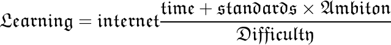

<!-- Generated from spear_resumes profile/facts.toml by `just profile` (profile/render/render.py). Do not edit by hand. -->

<picture>
  <source media="(prefers-color-scheme: dark)" srcset="svg/header-dark.svg">
  
</picture>

[GitHub](https://github.com/Jesssullivan) · [Blog](https://transscendsurvival.org) · [CV](https://transscendsurvival.org/cv) · [AAG poster](https://transscendsurvival.org/aag) · [LinkedIn](https://www.linkedin.com/in/jess-sullivan-11032a367/) · [xoxd.ai](https://xoxd.ai) · [xoxd.ai on GitHub](https://github.com/xoxd-ai) · [Great Falls Tool Bus](https://greatfallstoolbus.org) · [Email](mailto:jess@sulliwood.org) · 

Senior full-stack and systems engineer with 8+ years building software across TypeScript/SvelteKit, Python, Go, C++, Rust, Zig, Chapel, Haskell, and Nix-first infrastructure.

### Now

- **Founder, [xoxd.ai](https://xoxd.ai)** (2024–present). Bootstrapped engineering and contracting firm: infrastructure automation, build platforms, agent orchestration for semi-autonomous infrastructure lifecycle management, and full business stacks for clients. Building glorious.build, a cache-first build and CI substrate (Bazel remote cache and execution, Nix, pooled self-hosted runners); pre-launch.
- **Systems Analyst (DevSecOps), Bates College** (2024–present). Build and maintain enterprise systems supporting staff, faculty, and the technical ILS team. 24/7 on-call for CVE triage and mitigation; help lead IaC and dev-CI parity college-wide.
- **[Great Falls Tool Bus](https://greatfallstoolbus.org)** (2026–present). Founder of the Great Falls Tool Bus, a member-run tool and gear lending library in Lewiston, ME, and builder of its site and member infrastructure.
- **Kitten Spit Labs** (ongoing). Ultrasonics and piezoelectric lab-equipment venture focused on ultrasonic chaining of metapolymers.

### Project map

<picture>
  <source media="(prefers-color-scheme: dark)" srcset="svg/project-map-dark.svg">
  
</picture>

Data

| Project | Category | Link |
|---|---|---|
| birdsong-identification interpreter experiments and demos | Applied ML & classification | [repository](https://github.com/Jesssullivan/MerlinAI-Interpreters) |
| image-based mushroom identification experiments for MushroomObserver | Applied ML & classification | [repository](https://github.com/Jesssullivan/mo-image-identifier) |
| a Leaflet audio annotator for squirrel and chipmunk calls | Applied ML & classification | [repository](https://github.com/Jesssullivan/squirrel-leaflet-annotation) |
| ASM2362 NVMe recovery experiments and FTL-corruption research | Kernel, firmware & security research | [repository](https://github.com/Jesssullivan/hiberpower-ntfs) |
| key-free, native-Linux recovery tooling for Canon MegaTank printers' ink-absorber lockout | Kernel, firmware & security research | [repository](https://github.com/Jesssullivan/canon-megatank-reset) |
| a native KeePassXC KDBX database reader | Kernel, firmware & security research | not linked |
| a research fork of Magic Lantern firmware | Kernel, firmware & security research | [repository](https://github.com/Jesssullivan/magiclantern_hydrogen) |
| Rocky Linux 10 real-time (PREEMPT_RT) kernel lane carrying XR display patches and Dirty Frag security backports | Kernel, firmware & security research | [repository](https://github.com/xoxd-ai/linux-xr) |
| early Chapel experiments: duplicate checking, string iteration and parallel evaluation | Compilers, HPC & functional compute | [repository](https://github.com/Jesssullivan/ChapelTests) |
| glyph-compositor research with Futhark and WebGPU | Compilers, HPC & functional compute | [repository](https://github.com/Jesssullivan/pixelwise-research) |
| property-based testing package for Chapel | Compilers, HPC & functional compute | [repository](https://github.com/Jesssullivan/quickchpl) |
| provenance-clean Bessel functions (J0, J1 and J1 roots) for Futhark | Compilers, HPC & functional compute | [repository](https://github.com/Jesssullivan/futhark-bessel) |
| an accounting and financial-modeling R package and MCP tool surface for GnuCash | Systems libraries & tools | [repository](https://github.com/Jesssullivan/gnucashr) |
| a cross-platform disk-cleanup daemon with graduated thresholds (Go, Nix, systemd and launchd) | Systems libraries & tools | not linked |
| in-progress encrypted sync filesystem (Linux FUSE + macOS FileProvider) | Systems libraries & tools | [repository](https://github.com/Jesssullivan/tummycrypt) |
| an XWayland Emacs window manager experimenting with eye-gesture and XR input | Systems libraries & tools | [repository](https://github.com/Jesssullivan/XoxdWM) |
| Zig capability libraries with C ABIs | Systems libraries & tools | [repository 1](https://github.com/Jesssullivan/zig-crypto) · [repository 2](https://github.com/Jesssullivan/zig-ctap2) · [repository 3](https://github.com/Jesssullivan/zig-keychain) · [repository 4](https://github.com/Jesssullivan/zig-notify) |
| automated patching for Chrome Remote Desktop on Budgie and GNOME desktops | Build systems & infrastructure | [repository](https://github.com/Jesssullivan/chrome-remote-desktop-budgie) |
| a Bazel module registry for the firm's published packages | Build systems & infrastructure | [repository](https://github.com/xoxd-ai/bazel-registry) |
| Bazel rules for compiling LaTeX to PDF with Tectonic | Build systems & infrastructure | [repository](https://github.com/Jesssullivan/rules_tectonic) |
| a Caddy, Tailscale and DNS reverse-proxy demo | Build systems & infrastructure | [repository](https://github.com/Jesssullivan/ts-caddy) |
| a Dhall-typed Tailscale ACL policy with continuous delivery | Build systems & infrastructure | [repository](https://github.com/Jesssullivan/tailnet-acl) |
| Raspberry Pi image tooling: emulate, organize, burn and manage Debian images | Build systems & infrastructure | [repository](https://github.com/Jesssullivan/clipi) |
| Tailscale Aperture configuration bootstrapped from tagged devices over tsnet | Build systems & infrastructure | [repository](https://github.com/Jesssullivan/aperture-bootstrap) |
| a utility for out-of-band management of air-gapped network devices | Build systems & infrastructure | [repository](https://github.com/Jesssullivan/DarwinNicUtil) |
| experimental OAuth multiplexing for autonomous agents and people | Software-lifecycle automation | [repository](https://github.com/Jesssullivan/oauth-mux) |
| a formal, auditable tool surface for playing the adversary in security testing | Software-lifecycle automation | not linked |
| Linear and Google Workspace automation for calendar-facing operational workflows | Software-lifecycle automation | [repository](https://github.com/xoxd-ai/linear-gsuite) |
| a local agent-research condenser with provenance-preserving prompt minimization | Software-lifecycle automation | [repository](https://github.com/Jesssullivan/prompt-toon) |
| reusable GitHub Actions composite actions for Nix, Attic cache and CI/CD | Software-lifecycle automation | [repository](https://github.com/xoxd-ai/ci-templates) |
| a self-bootstrapping LangGraph DAG harness for Ansible iteration cycles in GitLab | Software-lifecycle automation | [repository](https://github.com/Jesssullivan/Ansible-DAG-Harness) |
| an ActivityPub federation library | Web product & libraries | not linked |
| an authentication library with TOTP, RBAC and pluggable storage | Web product & libraries | not linked |
| a backend-agnostic scheduling system with Acuity, Cal.com and native adapters | Web product & libraries | [repository](https://github.com/xoxd-ai/scheduling-kit) |
| a calendar library with CalDAV, iCal, RRULE and time-zone support | Web product & libraries | not linked |
| a Flask image server with Lanczos resampling | Web product & libraries | [repository](https://github.com/Jesssullivan/FastPhotoAPI) |
| framework-agnostic rate-limiting and CSRF middleware | Web product & libraries | not linked |
| the Great Falls Tool Bus apex site for Lewiston-Auburn, Maine | Web product & libraries | [repository](https://github.com/Great-Falls-Tool-Bus/gftb-site) |
| markdown content services with versioning, scheduling and relationship resolution | Web product & libraries | not linked |
| an OpenTelemetry instrumentation layer with a TraceQL query builder and RED metrics | Web product & libraries | not linked |
| physics-simulated animated vector backgrounds for Svelte 5 | Web product & libraries | [repository](https://github.com/xoxd-ai/tinyvectors) |
| a public dark-sky planning map for astronomy, field sensing and low-light logistics | Web product & libraries | [repository](https://github.com/Jesssullivan/darkmap.phasi.space) |
| request-security utilities: IP hashing, encryption, risk scoring and timing-safe helpers | Web product & libraries | not linked |
| a static rewrite of the transscendsurvival.org blog | Web product & libraries | [repository](https://github.com/Jesssullivan/jesssullivan.github.io) |
| a streaming accessibility evaluation engine: WCAG contrast, ARIA and keyboard-navigation checks | Web product & libraries | not linked |
| structured logging with Loki integration and OpenTelemetry trace correlation | Web product & libraries | not linked |
| a tutorial for writing a command-line utility in modern TypeScript | Web product & libraries | [repository](https://github.com/Jesssullivan/IntroTypeScript) |
| a Vite plugin for build-time WCAG checks of Svelte components | Web product & libraries | [repository](https://github.com/xoxd-ai/vite-plugin-a11y) |
| a Vite plugin generating Skeleton UI color-pairing utilities on demand | Web product & libraries | [repository](https://github.com/xoxd-ai/vite-plugin-skeleton-colors) |
| Zod schemas, field validators and Superforms integration helpers | Web product & libraries | not linked |
| 3D-printer profiles for the Ithaca Generator makerspace | GIS, fabrication & community | [repository](https://github.com/Jesssullivan/IG-3DP-Profiles) |
| CAD-as-code 19-inch rack mounts for ATX power supplies | GIS, fabrication & community | [repository](https://github.com/Jesssullivan/modular-atx-power-rack) |
| open-source stepper hardware for coil winding | GIS, fabrication & community | [repository](https://github.com/Jesssullivan/Arduino_Coil_Winder) |
| R / Shiny KML geoprocessing tools | GIS, fabrication & community | [repository](https://github.com/Jesssullivan/Shiny-Apps) |
| R processing for bird point-count field data | GIS, fabrication & community | [repository](https://github.com/Jesssullivan/FieldProcessing) |
| shelving and related CAD drawings for the Great Falls Tool Bus | GIS, fabrication & community | [repository](https://github.com/Great-Falls-Tool-Bus/cad) |
| a UV-reactive 3D-printer bed adhesive: recipe, scaler and Klipper integration | GIS, fabrication & community | not linked |

### Merged upstream work

<picture>
  <source media="(prefers-color-scheme: dark)" srcset="svg/upstream-dark.svg">
  
</picture>

Data

| Project | Merged | Relation | Link |
|---|---|---|---|
| llama.cpp | 2026-09-25 | Merged pull request | [pull request](https://github.com/ggml-org/llama.cpp/pull/29283) |
| nixpkgs | 2026-06-04 | Merged pull request | [pull request](https://github.com/NixOS/nixpkgs/pull/516711) |
| KeePassXC | 2026-05-27 | Committer | [pull request](https://github.com/keepassxreboot/keepassxc/pull/13383) |
| ShikiJS textmate-grammars-themes | 2026-05-19 | Merged pull request | [pull request](https://github.com/shikijs/textmate-grammars-themes/pull/203) |
| numtide/nix-vm-test | 2026-04-22 | Merged pull request | [pull request](https://github.com/numtide/nix-vm-test/pull/172) |
| cmux | 2026-03-21 | Merged pull request | [pull request](https://github.com/manaflow-ai/cmux/pull/1877) |
| rspamd | 2026-03-09 | Committer | [pull request](https://github.com/rspamd/rspamd/pull/5923) |
| svelte-superforms | 2026-02-22 | Merged pull request | [pull request](https://github.com/ciscoheat/sveltekit-superforms/pull/678) |
| Futhark | 2026-02-10 | Merged pull request | [pull request](https://github.com/diku-dk/futhark/pull/2365) |
| Chapel Mason registry | 2026-01-16 | Committer | [pull request](https://github.com/chapel-lang/mason-registry/pull/77) |
| xCaddy | 2025-05-05 | Merged pull request | [pull request](https://github.com/caddyserver/xcaddy/pull/238) |
| Klipper | 2023-03-28 | Merged pull request | [pull request](https://github.com/Klipper3d/klipper/pull/6112) |

### Language mix

<picture>
  <source media="(prefers-color-scheme: dark)" srcset="svg/languages-dark.svg">
  
</picture>

Data

| Language | Share |
|---|---|
| TypeScript | 31% |
| Python | 22% |
| C | 6% |
| Zig | 5% |
| Starlark | 4% |
| Shell | 4% |
| Chapel | 3% |
| R | 3% |
| Other | 22% |

### Roles and ventures

<picture>
  <source media="(prefers-color-scheme: dark)" srcset="svg/timeline-dark.svg">
  
</picture>

Data

| Organization | Role | Dates | Summary |
|---|---|---|---|
| Bates College | Systems Analyst (DevSecOps) | 2024–present | Build and maintain enterprise systems supporting staff, faculty, and the technical ILS team. 24/7 on-call for CVE triage and mitigation; help lead IaC and dev-CI parity college-wide. |
| Macaulay Library, Cornell Lab of Ornithology | Computer Vision Software Engineer | 2019–2021 | Developed & launched Merlin Sound ID, a production fine-grained audio classification system used by millions worldwide. |
| Cornell CALS Landscape Architecture (DLA Makerspace) | Fabrication Laboratory Manager | 2021–2022 | Developed and taught rapid-fabrication curricula. |
| Full-Stack Contracting & FOSS | Independent contractor | 2017–present | Independent contractor; active upstream contributor and committer. |
| Columbari.us LLC |  | 2017–2021 | Independent contractor / contributor business while in the GIS & ML space. |
| Moonlight Coworking LLC |  | 2021–2024 | Formed in NY to raise capital and interest in a for-profit hackerspace with a focus on mathematics and high performance computing alongside my nonprofit work leading the Ithaca Generator; shelved due to move to Maine. |
| xoxd.ai | Founder | 2024–present | Bootstrapped engineering and contracting firm: infrastructure automation, build platforms, agent orchestration for semi-autonomous infrastructure lifecycle management, and full business stacks for clients. |
| Kitten Spit Labs |  | ongoing | Ultrasonics and piezoelectric lab-equipment venture focused on ultrasonic chaining of metapolymers. |
| Great Falls Tool Bus | Founder | 2026–present | Founder of the Great Falls Tool Bus, a member-run tool and gear lending library in Lewiston, ME, and builder of its site and member infrastructure. |

### Community

- Ongoing engagement with the Rocky Enterprise Linux Foundation (Rocky 10 platform, real-time (PREEMPT_RT) kernel lanes, and downstream CVE backport practice).
- First Fellow, D&M Makerspace, Plymouth State University (2017–2020)
- Membership Chair & 3D Printing Captain, Ithaca Generator (2020–2022)

### Publications

- Sullivan, J. (2026). [Recovering Write-Protected NVMe SSDs Through USB Bridge XRAM Injection: Bypassing the ASMedia ASM2362 Firmware Opcode Whitelist](https://transscendsurvival.org/papers/recovery-paper.pdf).
- Reitsma, L.R., Burns, C., & Sullivan, J. (2019). [Poecile atricapillus (Black-capped Chickadee) Feeding Catharus guttatus (Hermit Thrush) Nestlings](https://doi.org/10.1656/045.026.0213). Northeastern Naturalist, 26(2).
- Sullivan, J. (2019). Web GIS: Telling Stories & Solving Problems. AAG Annual Meeting.

<picture><source media="(prefers-color-scheme: dark)" srcset="img/CodeCogsEqn-1-dark.png"></picture>

> Hey! I am always hacking, learning, building, reading, and tinkering. Day in, day out, this is what I do.
